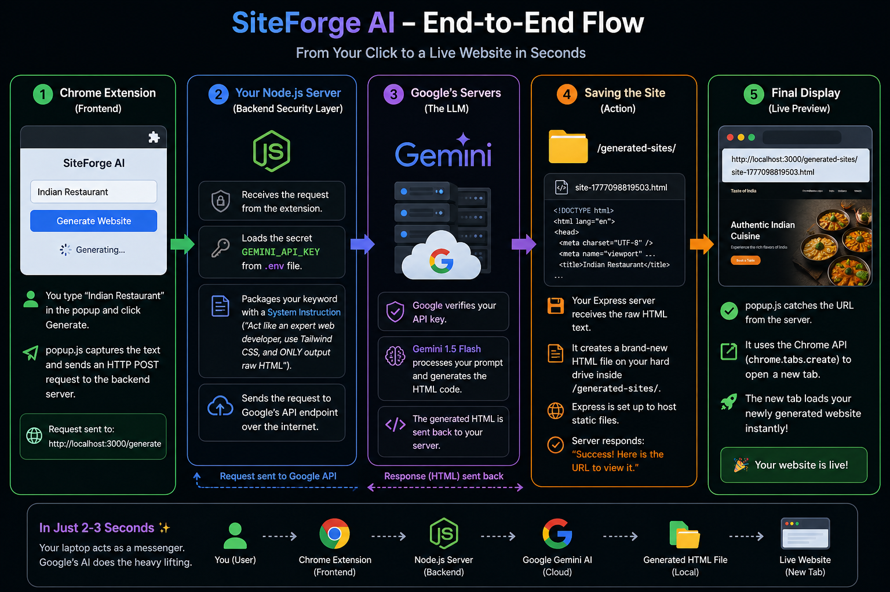

# SiteForge AI 🚀

<div align="center">
  
  
  <h3>🎥 <a href="https://youtu.be/PVifp81eRuM">Watch the Live Video Demo here!</a> 🎥</h3>
</div>

A full-stack project featuring a Chrome Extension and a Node.js backend that instantly generates premium, fully responsive websites from a single keyword using the Google Gemini API.

## Features ✨
- **Cross-Platform**: Works flawlessly on Windows, macOS, and Linux.
- **Microservice Architecture**: Lightweight Chrome Extension communicates with a secure Node.js backend.
- **Secure by Design**: API keys are hidden securely in the backend using environment variables (`.env`).
- **AI-Powered Design**: Leverages **Google Gemini 1.5 Flash** for highly token-efficient, rapid generation of Tailwind CSS components.
- **Premium Aesthetics**: Prompt-engineered to generate glassmorphism, smooth gradients, and micro-animations out-of-the-box.
- **Zero-Friction Preview**: Automatically serves the newly generated HTML file over local static Express routes and instantly pops it open in a new Chrome tab.

## Project Structure 📂
```
.
├── extension/          # Manifest V3 Chrome Extension front-end
│   ├── manifest.json   # Extension configuration
│   ├── popup.html      # UI layer
│   ├── popup.js        # Logic layer
│   └── styles.css      # Premium UI styling
├── server/             # Express.js Application back-end
│   ├── index.js        # Core API router and Gemini integration
│   ├── package.json    # Dependencies
│   └── .env            # Environment configuration (Keys)
└── README.md
```

## Setup Instructions 🛠️

### 1. Start the Backend Server (Node.js)
You must have [Node.js](https://nodejs.org/) installed on your machine.
1. Open a terminal and navigate to the server folder: `cd server`
2. Install dependencies: `npm install`
3. Create a `.env` file in the `server` directory and add your Google Gemini API key:
   ```env
   GEMINI_API_KEY=your_key_here
   GEMINI_MODEL=gemini-1.5-flash
   PORT=3000
   ```
4. Start the server: `npm start`
5. *The backend is now actively listening on `http://localhost:3000`*

### 2. Install the Chrome Extension
1. Open your browser and navigate to `chrome://extensions/`
2. Toggle on **Developer Mode** in the top right.
3. Click **Load unpacked** and select the `/extension` directory.
4. Pin the extension to your toolbar and you are ready to go!

## Usage 🎯
1. Click the extension icon.
2. Type in your desired industry (e.g. *"Luxury Car Rental"*, *"Italian Restaurant"*).
3. Click **Generate**.
4. The AI will weave raw HTML with Tailwind CSS, and when complete, present you with the final website instantly in a new tab.

## Cross-Platform Compatibility 💻
This project utilizes the `path` module natively to handle filesystem paths (e.g., `path.join()`) removing issues between Windows (`\`) and Unix (`/`) filesystems. Everything is containerized efficiently in the local Node runtime.

## Future Improvements 📈
- Add MongoDB to store previously generated websites natively.
- Integrate WebSockets for real-time streaming of HTML generation to the extension popup.
- Integrate a deployment webhook (like Vercel/Netlify) to instantly take the AI websites live to the public internet.
